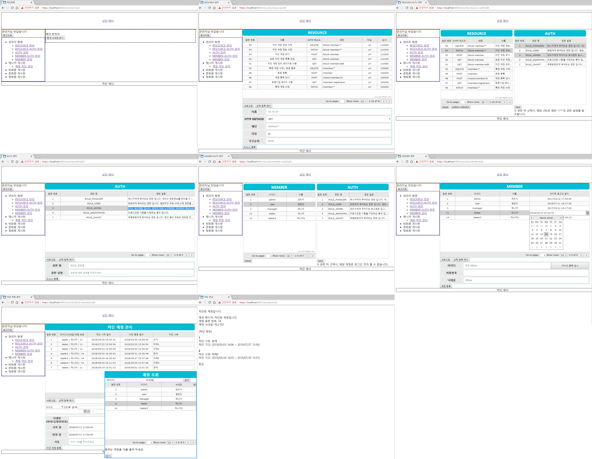
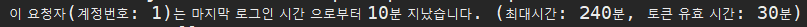
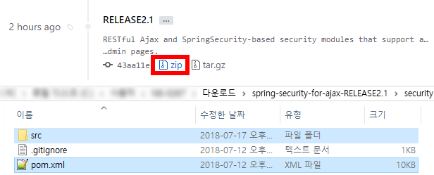
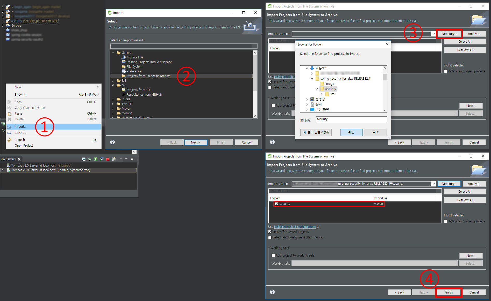
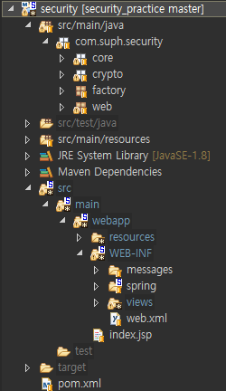

# spring-security-for-ajax
1. 소개
	>URL별 접근 권한을 DB와 브라우저를 통해 관리 하도록 커스텀 한 Spring Security 프로젝트 입니다.
	>홈페이지 제작 초기, 권한과 계정에 관련된 손쉬운 관리자 페이지 구성을 목적으로 하고 있습니다.
	
2. 특징
	* DB를 통한 URL별 권한 관리 
	
	* 계정 차단 기능
    * 브라우저 제어 페이지 제공
	* JWT 쿠키 기반 인증 관리
	* HTTPS
	* XST & CSRF 대비
	* [스키마 제공](http://aquerytool.com:80/aquerymain/index/?rurl=2683372d-5247-46dc-88fa-aa75874269e1) ( 비밀번호: 071t1w )
	* [REST API](https://docs.google.com/spreadsheets/d/14MDwNU1ajrObKSupSIGp9-trq5ls0ULwseZJEQuq-r8/edit?usp=sharing)
	* XML기반 Bean 관리
	
3. 세부기능
	* 기본 계정: admin/admin, manager/manager, user/user 
	
	* 마지막 요청 후 오래 경과한 요청에 대해 재로그인 유도 (기본값: 30분)
	* 활동과 관계없이 오래 경과한 로그인 유저에 대해 재로그인 유도 (기본값: 240분)
	* HTTP Method 中 TRACE / OPTIONS 제한 (XST 방어 목적)
	* 현 시점에서 XSS 필터링은 제공하지 않습니다.
	
4. 의존성
	* Spring Framework 4.3.12.RELEASE
	* Spring Security 4.2.4.RELEASE
	* Spring ORM 4.3.12.RELEASE
	* MySQL connector 5.1.32
	* commons-dbcp2
	* MyBatis
	* jackson
	* [JJWT](https://github.com/jwtk/jjwt)
	* [jqxGrid(jQuery UI Widgets)](https://www.jqwidgets.com/jquery-widgets-demo/demos/jqxgrid/index.htm)
	* etc...

5. 개발환경
	* Spring Tool Suite 3.8.2
	* Tomcat v9.0
	* Java 8
	* MariaDB
	* Windows 10

6. 사용법
	1. 최신 릴리즈의 압축파일을 다운로드 받아, 원하는 폴더에 압축해제 하십시오.
	2. 프로젝트 구성에 필요한 파일은 src폴더와 pom.xml 뿐입니다. 
	
	3. STS 혹은 이클립스 등의 즐겨사용하는 에디터에서 사진의 순서대로 프로젝트 임포트를 진행하십시오. 
	
	4. 임포트한 프로젝트 기반으로 원하는 웹사이트를 만들어 가십시오. 
	
	5. 최초 접속 주소는 https://localhost:8080/security 입니다.
	6. CONTEXT PATH 변경 시엔 /src/main/webapp/resources/scripts/ui/common/common.js 파일의 CONTEXT_PATH 값을 함께 변경하십시오.
	
7. 그 외 설정 관련 정보
	1. 톰캣을 사용할 경우 server.xml에 다음의 코드를 추가하십시오. (인터넷을 참고해 HTTPS 인증서를 미리 생성해 두어야 합니다)
		<pre>&lt;Connector connectionTimeout="20000" port="8080" protocol="HTTP/1.1" redirectPort="8443"/&gt;
		&lt;Connector
			port="8443"
			protocol="org.apache.coyote.http11.Http11NioProtocol"
			SSLEnabled="true"
			clientAuth="false"
			maxThreads="150"
			keystoreFile="C:\Your Keystore File Path"
			keystorePass="Your Password"
			scheme="https"
			secure="true"
			sslProtocol="TLS"
		/&gt;</pre>
		
	2. HTTPS 인증서를 생성하고, 위 ㄱ. 항목에 그 경로와 비밀번호를 추가하십시오.
	3. src/main/resources/properties/database.properties에 본인의 데이터베이스 접속 정보를 입력하십시오.
		<pre>jdbc.driverClassName=org.mariadb.jdbc.Driver
		jdbc.url=jdbc:mariadb://your_ip:your_port/your_repository_name
		jdbc.username=my_id
		jdbc.password=myp@ssword1#</pre>
	4. http 8080 포트로 접속할 경우 https 8443 포트로 리디렉트 됩니다.
	5. MySQL 설치 후, security/src/main/resources/mybatis/sql_generate 이하의 SQL문을 모두 실행하십시오.
	6. https://localhost:8443/security 접속
