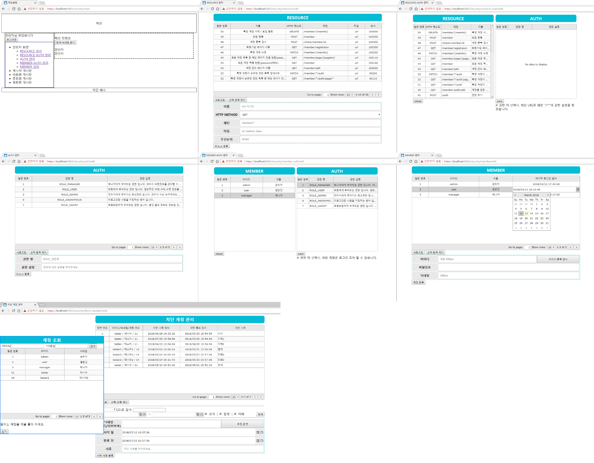

# security_practice
1. 소개
	>URL별 접근 권한을 DB와 브라우저를 통해 관리 하도록 커스텀 한 Spring Security 프로젝트 입니다.
	
2. 특징
	* DB를 통한 URL별 권한 관리 
	
    * 브라우저 제어 페이지 제공
	* JWT 쿠키 기반 인증 관리
	* HTTPS
	* XST & CSRF 대비
	* [스키마 제공](http://aquerytool.com:80/aquerymain/index/?rurl=2683372d-5247-46dc-88fa-aa75874269e1) ( 비밀번호: 071t1w )
	* [REST API](https://docs.google.com/spreadsheets/d/14MDwNU1ajrObKSupSIGp9-trq5ls0ULwseZJEQuq-r8/edit?usp=sharing)
	* XML기반 Bean 관리
3. 세부기능
	* 마지막 로그인 후 오래 경과한 요청에 대해 재로그인 유도 (기본값: 240분)
	* 마지막 요청으로부터 오래 경과한 요청에 대해 재로그인 유도 (기본값: 10분)
		1. 10분 단위 새로고침시 240분까지 로그인 유지 가능
		2. 페이지를 15분 간 읽은 후, 새로고침 시 재로그인 필요
	* 기본 계정: admin/admin, manager/manager, user/user
	* HTTP Method 中 TRACE / OPTIONS 제한 (XST 방어 목적)
	
4. 의존성
	* Spring Framework 4.3.12.RELEASE
	* Spring Security 4.2.4.RELEASE
	* Spring ORM 4.3.12.RELEASE
	* MySQL connector 5.1.32
	* commons-dbcp2
	* MyBatis
	* jackson
	* [JJWT](https://github.com/jwtk/jjwt)
	* etc...

5. 개발환경
	* Spring Tool Suite 3.8.2
	* Tomcat v9.0
	* Java 8
	* MariaDB
	* Windows 10

6. 사용법
	1. 톰캣을 사용할 경우 server.xml에 다음의 코드를 추가하십시오. (인터넷을 참고해 HTTPS 인증서를 미리 생성해 두어야 합니다)
		<pre>&lt;Connector connectionTimeout="20000" port="8080" protocol="HTTP/1.1" redirectPort="8443"/&gt;
		&lt;Connector
			port="8443"
			protocol="org.apache.coyote.http11.Http11NioProtocol"
			SSLEnabled="true"
			clientAuth="false"
			maxThreads="150"
			keystoreFile="C:\Your Keystore File Path"
			keystorePass="Your Password"
			scheme="https"
			secure="true"
			sslProtocol="TLS"
		/&gt;</pre>
		
	2. HTTPS 인증서를 생성하고, 위 ㄱ. 항목에 그 경로와 비밀번호를 추가하십시오.
	3. src/main/resources/properties/database.properties에 본인의 데이터베이스 접속 정보를 입력하십시오.
		<pre>jdbc.driverClassName=org.mariadb.jdbc.Driver
		jdbc.url=jdbc:mariadb://your_ip:your_port/your_repository_name
		jdbc.username=my_id
		jdbc.password=myp@ssword1#</pre>
	4. http 8080 포트로 접속할 경우 https 8443 포트로 리디렉트 됩니다.
	5. MySQL 설치 후, security/src/main/resources/mybatis/sql_generate 이하의 SQL문을 모두 실행하십시오.
	6. https://localhost:8443/security 접속
